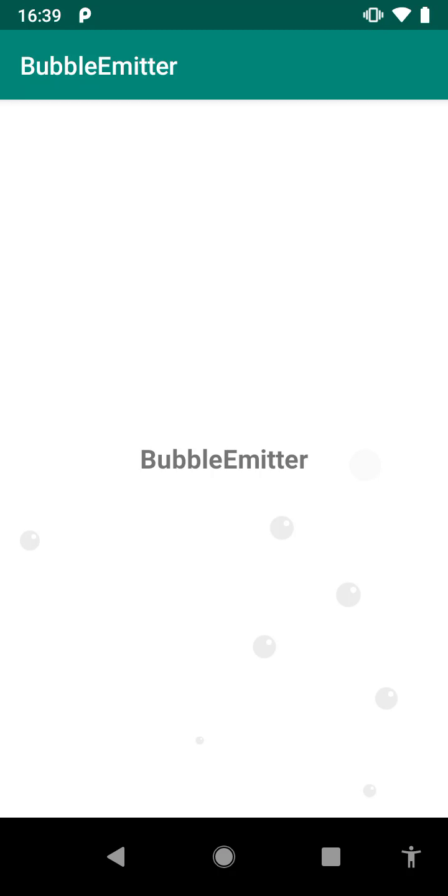

# BubbleEmitter [](https://jitpack.io/#FireZenk/BubbleEmitter) <a href="https://android-arsenal.com/api?level=16"></a>

Shows fancy animated bubbles as an Android view



### GRADLE
Add it in your root `build.gradle` at the end of repositories:

```groovy
allprojects {
	repositories {
		...
		maven { url 'https://jitpack.io' }
	}
}
```

Add the dependency:

```groovy
dependencies {
        implementation 'com.github.FireZenk:BubbleEmitter:-SNAPSHOT'
}
```

### USAGE

Add the view to your layout:

```xml
<org.firezenk.bubbleemitter.BubbleEmitterView
          android:id="@+id/bubbleEmitter"
          android:layout_width="match_parent"
          android:layout_height="match_parent"/>
```

Start emitting bubbles!

```kotlin
bubbleEmitter.emitBubble(size)
```

### CUSTOMIZATION

```kotlin
fun setColors(@ColorInt stroke: Int, @ColorInt fill: Int, @ColorInt gloss: Int)

fun setColorResources(@ColorRes stroke: Int, @ColorRes fill: Int, @ColorRes gloss: Int

fun setEmissionDelay(delayMillis: Long)
```

More customizations to come!

### MORE INFO

```
Go to sample module
```

### LICENSE

```
The MIT License (MIT)

Copyright (c) 2019 Jorge Garrido Oval <firezenk@gmail.com>

Permission is hereby granted, free of charge, to any person obtaining a copy
of this software and associated documentation files (the "Software"), to deal
in the Software without restriction, including without limitation the rights
to use, copy, modify, merge, publish, distribute, sublicense, and/or sell
copies of the Software, and to permit persons to whom the Software is
furnished to do so, subject to the following conditions:

The above copyright notice and this permission notice shall be included in
all copies or substantial portions of the Software.

THE SOFTWARE IS PROVIDED "AS IS", WITHOUT WARRANTY OF ANY KIND, EXPRESS OR
IMPLIED, INCLUDING BUT NOT LIMITED TO THE WARRANTIES OF MERCHANTABILITY,
FITNESS FOR A PARTICULAR PURPOSE AND NONINFRINGEMENT. IN NO EVENT SHALL THE
AUTHORS OR COPYRIGHT HOLDERS BE LIABLE FOR ANY CLAIM, DAMAGES OR OTHER
LIABILITY, WHETHER IN AN ACTION OF CONTRACT, TORT OR OTHERWISE, ARISING FROM,
OUT OF OR IN CONNECTION WITH THE SOFTWARE OR THE USE OR OTHER DEALINGS IN
THE SOFTWARE.
```
